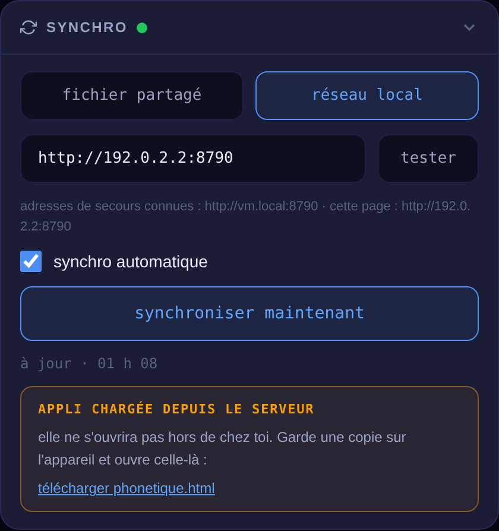

# Synchro de Phonétique sur le réseau local

Tes cartes, mots et scores partagés entre le PC, le Chromebook et le téléphone,
**sans nuage** : tout reste chez toi. Chaque appareil garde ses données et
fonctionne sans réseau ; la synchro est une étape séparée qui ne bloque jamais.

```
PC Windows ── phonetique-sync.mjs (Node, zéro dépendance)
                ├─ http  :8790  → appli + /ca.crt + données
                └─ https :8791  → appli installable (PWA), certificat auto-généré

Source de vérité : un seul phonetique-donnees.json sur le PC
```

## Mise en route sur le PC

1. Node 18 ou plus récent.
2. Mets dans un même dossier : `index.html`, `phonetique-sync.mjs`,
   `phonetique-cert.mjs`, `phonetique-sync.cmd`.
3. Double-clique **`phonetique-sync.cmd`** (ou `node phonetique-sync.mjs`).
4. Au premier lancement, Windows demande l'autorisation réseau :
   accepte pour les réseaux **privés**.

La fenêtre affiche les adresses à utiliser. Laisse-la ouverte ; `Ctrl+C` arrête.

> Le port par défaut est **8790** (https sur 8791), différent de `noter` pour
> que les deux serveurs tournent en même temps sans se marcher dessus.

## Sur chaque appareil

Ouvre l'appli, va dans **Paramètres › Synchro**, choisis **réseau local**,
colle l'adresse affichée par le serveur, puis **tester**.



- **synchro automatique** : au retour du réseau, au retour sur l'appli, et
  toutes les 45 secondes.
- **synchroniser maintenant** : force un tour immédiat.
- La ligne d'état indique `à jour · 20:40`, ou `hors réseau · 3 modifications
  en attente` quand le PC est éteint — ce n'est pas une erreur, juste une
  attente.

### Chromebook et PC

Une copie locale du `.html` fonctionne et s'ouvre même hors réseau. Vise
`http://<IP-du-PC>:8790`.

### Téléphone Android

1. Installe l'autorité : ouvre `http://<IP>:8790/ca.crt`, puis
   Paramètres › Sécurité › Chiffrement et identifiants › Installer un
   certificat › **Certificat CA**. Android exige un code de verrouillage.
2. Ouvre `https://<IP>:8791`.
3. Menu du navigateur › **Installer l'application**.

**Prends l'adresse en chiffres**, pas le nom en `.local` : Android ne sait
généralement pas le résoudre, même si le certificat le couvre et qu'il marche
depuis le PC.

⚠️ Installer une autorité sur un téléphone signifie que la clé privée restée
sur le PC peut usurper n'importe quel site auprès de cet appareil. Le dossier
`phonetique-certs/` ne doit jamais quitter ta machine — il est exclu du dépôt
par `.gitignore`.

## Mode « fichier partagé »

Sans serveur : **fusionner un fichier…** prend un `.json` exporté depuis un
autre appareil (clé USB, dossier partagé, nuage) et le **fusionne** au lieu
d'écraser — contrairement à l'import classique. Puis **exporter l'état
fusionné** pour le rapporter.

## Comment la fusion décide

Enregistrement par enregistrement, jamais fichier par fichier. Chaque carte
porte **trois horodatages indépendants** :

| horodatage | ce qu'il couvre |
|---|---|
| `uContent` | mot, API, définition, genre, étiquettes, couleur, suppression |
| `uReview`  | intervalle, facilité, répétitions, prochaine échéance |
| `uPlace`   | paquet d'appartenance |

Réviser une carte sur le téléphone pendant que tu corriges sa définition sur le
PC ne fait donc rien perdre : chaque groupe se compare séparément, et le plus
récent gagne — indépendamment des autres.

Le reste : scores et bilans fusionnent en **gardant le meilleur** ; les
réglages forment un bloc unique où le dernier appareil qui les modifie gagne ;
l'historique de recherche est une union dédoublonnée plafonnée à 30.

Les suppressions laissent une **pierre tombale** horodatée, purgée après
90 jours. Sans elle, l'autre appareil renverrait l'enregistrement à la synchro
suivante et il ressusciterait.

## Ce que le serveur ne fait pas

Il ne fusionne rien : il garde le dernier état complet envoyé par un appareil,
qui a déjà fusionné le distant avec son local. Il vérifie seulement que ce
qu'il reçoit ressemble à des données de Phonétique — un JSON valide mais
étranger écraserait tout.

Avant chaque écriture il fait une **copie horodatée** dans
`phonetique-copies/` (les 30 dernières), et l'écriture est **atomique** :
fichier temporaire puis renommage, pour qu'une coupure de courant ne laisse
jamais un fichier à moitié écrit.

## Si ça ne marche pas

| symptôme | cause probable |
|---|---|
| Marche sur le Chromebook, échoue sur le téléphone | l'en-tête `Access-Control-Allow-Private-Network` — le serveur l'envoie déjà ; vérifie que tu passes bien par lui |
| `DNS_PROBE_FINISHED_NXDOMAIN` sur Android | tu as utilisé un nom `.local` ; prends l'IP |
| L'appli installée ne s'ouvre plus | l'IP du PC a changé — réserve-la dans ta box |
| Bandeau rouge « ne peut rien enregistrer » | fichier ouvert depuis les Téléchargements Android (`content://`) : passe par l'adresse du serveur |
| L'appli servie ne s'ouvre pas hors réseau | c'est attendu en `http://` : utilise le lien de téléchargement du panneau, ou installe la version https |
| Le port 8790 est pris | `PORT=8792 node phonetique-sync.mjs` |

## Sauvegardes

Le fichier de données et ses copies vivent à côté du script et sont exclus du
dépôt. Ils sont ta vraie sauvegarde : pense à les copier ailleurs de temps en
temps.
